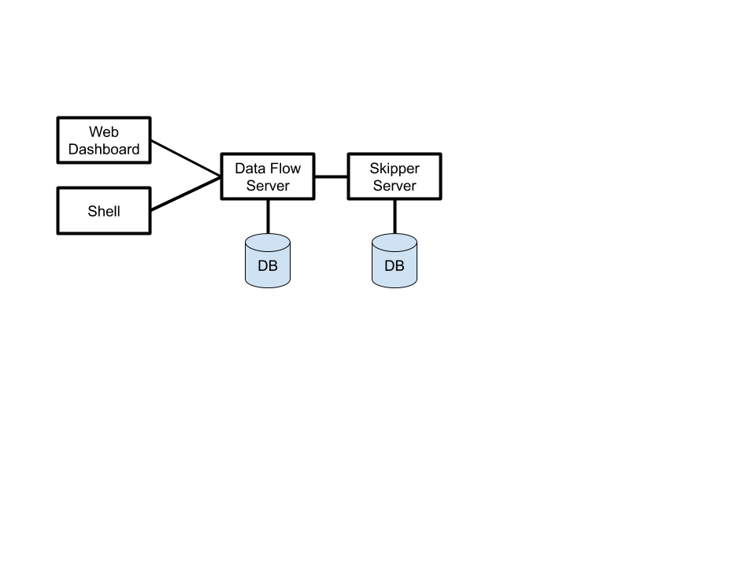
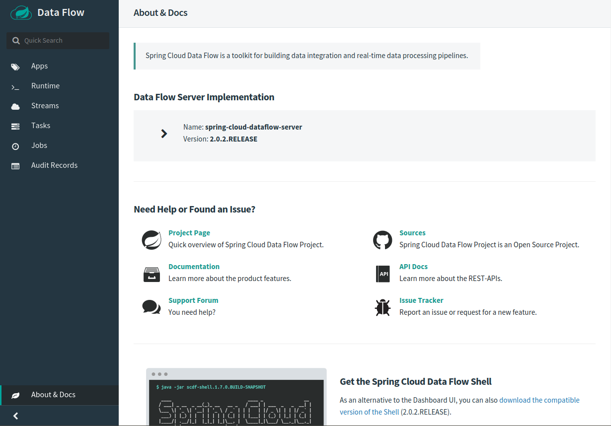
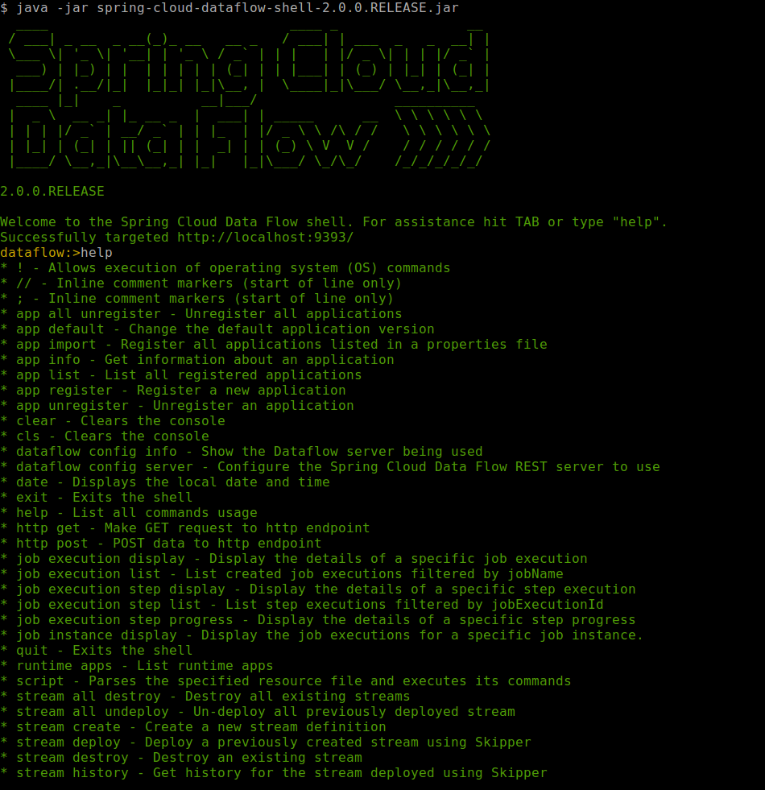

# Architecture

Data Flow has two main components:

- Data Flow Server
- Skipper Server

The main entry point to access Data Flow is through the Web API of the Data Flow Server.
The Web Dashboard is served from the Data Flow Server and a separate Data Flow Shell applications both communicate through the web API.

The servers can be run on several platforms: Cloud Foundry, Kubernetes, or on your Local machine.
Each server stores state in a relational database.

A high level view of the Architecture and the paths of communication are shown below.

The Data Flow Server is responsible for

- Parsing the Stream and Batch Job definitions based on a Domain Specific Language (DSL).
- Validating and persisting Stream, Task, and Batch Job definitions.
- Registering artifacts such as .jar and docker images to names used in the DSL.
- Deploying Batch Jobs to one or more platforms.
- Creating Skipper packages Delegating Stream Deployment to Skipper.
- Add properties to Stream applications that configure messaging inputs and outputs, monitoring labels.
- Audit actions such Stream create, deploy, undeploy and Batch create, launch, delete.
- Querying detailed Task and Batch Job execution history.
- Delegating Job scheduling to a platform.
- Providing Stream and Batch Job DSL tab-completion features.

The Skipper Server is responsible for:

- Deploying Streams to one or more platforms.
- Upgrading and rolling back deployed applications on one or more platforms using a State Machine based blue/green update strategy.
- Store the history of each application's manifest file that represents the final description of what has been deployed.

## Tooling

The Dashboard and Shell are the main ways you interact with Data Flow.
You can also hit the Web API using curl or write an applications that uses the Java client library which in turn calls the Web API.
The next section introduces the features of the Dashboard and the Shell.

### Dashboard

Spring Cloud Data Flow provides a browser-based GUI called the dashboard that organizes the features in Data Flow in several tabs on the left hand site.

- **Apps**: Lists all registered applications and provides the controls to register new applications or unregister existing applications.
- **Runtime**: Provides the list of all running applications.
- **Streams**: Lets you list, design, create, deploy, and destroy Stream Definitions.
- **Tasks**: Lets you list, create, launch, schedule and, destroy Task Definitions.
- **Jobs**: The Jobs tab lets you view detailed Spring Batch Job execution history and to restart a Job execution.
- **Audit Records**: Access to recorded audit events.
- **About**: Provides release information for use in support calls and links to documentation and the Data Flow Shell download.

### Shell

The shell can be used an alternative to the Dashboard to interact with Data Flow.
The shell has commands that can be perform most of the same tasks as listed before in the Dashboard section, the listing of Audit Records being the one exception.

It supports tab completion for commands and also for Stream/Batch DSL definitions. There are command line options for connecting the shell to the Data Flow Server.

You can get a listing of commands by typing `help` and then help for each individual command by typing `help <command>`
A partial listing of commands is shown below

### Web API

Data Flow's Web API tries to adhere as closely as possible to standard HTTP and REST conventions in its use of HTTP verbs.
For example, a `GET` verb is used to retrieve a resource and `POST` to create a new resource.  
Both the Dashboard and the UI are consumers of this API.

Data Flow uses hypermedia, and resources include links to other resources in their responses. Responses are in the Hypertext Application from resource to resource Language - [HAL](http://stateless.co/hal_specification.html). Links can be found beneath the `_links` key. Users of the API should not create URIs themselves. Instead. they should use the above-described links to navigate.

### Java Client

## Security

## System Requirements

**Java:** Data Flow uses Java 8.

**Database:** The Data Flow Server and Skipper Server need to have an RDBMS installed.
By default, the servers use an embedded H2 database.
You can easily configure the servers to use external databases.
The supported databases are H2, HSQLDB, MySQL, Oracle, Postgresql, DB2, and SqlServer.
The schemas are automatically created when each server starts.

**Messaging Middleware:** Deployed stream applications communicate via messaging middleware
product.
We provide prebuilt stream applications that use [RabbitMQ](https://www.rabbitmq.com) or
[Kafka](https://kafka.apache.org).
However, other [messaging middleware products](https://cloud.spring.io/spring-cloud-stream/#binder-implementations)
such as
[Kafka Streams](https://kafka.apache.org/documentation/streams/),
[Amazon Kinesis](https://aws.amazon.com/kinesis/),
[Google Pub/Sub](https://cloud.google.com/pubsub/docs/)
[Solace PubSub+](https://solace.com/software/)
and
[Azure Event Hubs](https://azure.microsoft.com/en-us/services/event-hubs/)
are supported.
