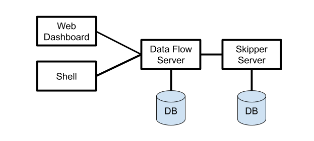

# Architecture

The main concepts of the architecture are the Server Components, the type of deployed applications and its runtime architecture, and the platform where they are deployed.

## Server Components

Data Flow has two main components:

- Data Flow Server
- Skipper Server

The main entry point to access Data Flow is through the Web API of the Data Flow Server.
The Web Dashboard is served from the Data Flow Server and a separate Data Flow Shell applications both communicate through the web API.

The servers can be run on several platforms: Cloud Foundry, Kubernetes, or on your Local machine.
Each server stores state in a relational database.

A high level view of the Architecture and the paths of communication are shown below.



The Data Flow Server is responsible for

- Parsing the Stream and Batch Job definitions based on a Domain Specific Language (DSL).
- Validating and persisting Stream, Task, and Batch Job definitions.
- Registering artifacts such as .jar and docker images to names used in the DSL.
- Deploying Batch Jobs to one or more platforms.
- Delegating Job scheduling to a platform.
- Querying detailed Task and Batch Job execution history.
- Add configuration properties to Streams that configure messaging inputs and outputs as well as passing along deployment properties such as initial number of instances, memory requirements and data partitioning.
- Delegating Stream Deployment to Skipper.
- Audit actions such Stream create, deploy, undeploy and Batch create, launch, delete.
- Providing Stream and Batch Job DSL tab-completion features.

The Skipper Server is responsible for:

- Deploying Streams to one or more platforms.
- Upgrading and rolling back Stream on one or more platforms using a State Machine based blue/green update strategy.
- Store the history of each Stream's manifest file that represents the final description of what applications have been deployed.

### Database

The Data Flow Server and Skipper Server need to have an RDBMS installed.
By default, the servers use an embedded H2 database.
You can easily configure the servers to use external databases.
The supported databases are H2, HSQLDB, MySQL, Oracle, Postgresql, DB2, and SqlServer.
The schemas are automatically created when each server starts.

### Security

## Application Types

Applications come in two flavors:

- Long-lived applications. There are two types of long-lived applications.

  - The first is a Spring Cloud Stream applicatios where an an unbounded amount of data is consumed or produced through messaging middleware.
  - The second is an arbitrary application that does not necessarily use messaging middleware, Spring Cloud Stream, or even Java.

- Short-lived applications that process a finite set of data and then terminate.  
  There are two types of short-lived applications.

  - The first is a Task which executes your code and records the status of execution in the Data Flow database.
    It can optionally use the Spring Cloud Task framework nor is it required for it to be a Java application.
    However, the application does need to record it's execution status Data Flow's database.
  - The second is a Spring Batch application that uses the classes and interfaces that are part of the Spring Batch Framework.

### Long-lived applications

The Spring Cloud Stream framework provides a programming model to simplify the writing of message-driven microservice applications.
You write the core business logic that is agnostic to the specific middleware that will be used.
The middleware to use is done by adding a Spring Cloud Stream Binder library to the classpath.
There are binders for

- [RabbitMQ](https://www.rabbitmq.com)
- [Kafka](https://kafka.apache.org)
- [Kafka Streams](https://kafka.apache.org/documentation/streams/)
- [Amazon Kinesis](https://aws.amazon.com/kinesis/)
- [Google Pub/Sub](https://cloud.google.com/pubsub/docs/)
- [Solace PubSub+](https://solace.com/software/)
- [Azure Event Hubs](https://azure.microsoft.com/en-us/services/event-hubs/)

It is common to use Spring Cloud Stream's support for creating an application that conforms to common message exchange contracts, such as

- `Source`: Message producer to a destination
- `Sink`: Message consumer from a destination
- `Processor`: The combination of a Source and a Sink. A Processor consumes message from a destination and produces messages to another destination

Applications of these three types are registered with Data Flow using the the using the name `source`, `processor` and `sink` to describe the `type` of the application being registered.

For example, the shell syntax for registration in the of a `http` source (that listens on a port and sends the message to a destination) and a `log` sink (that consumes from a destination and logs the received message) is

```
dataflow:>app register --name http --type source --uri maven://org.springframework.cloud.stream.app:http-source-rabbit:1.2.0.RELEASE
Successfully registered application 'source:http'

dataflow:>app register --name log --type sink --uri maven://org.springframework.cloud.stream.app:log-sink-rabbit:1.1.0.RELEASE
Successfully registered application 'sink:log'
```

With these names, `http` and `log`, registered with Data Flow, a stream definition can be created using the **Stream Pipeline DSL** that uses a pipes and filters syntax.

```
dataflow:>stream create --name httpStream --definition "http | log"
```

The pipe symbol is used to represent the connection of the source output to the sink input.  
Data Flow sets all the properties when deploying the stream so that the source can communicate with the sink.

However, not all applications have a single input or output. **Some applications might not be using messaging middleware at all.**
In this case you can register a long lived application using the type `app`.
This indicates to Data Flow not to try and set any properties to connect the two applications over messaging middleware.
If the applications are using messaging middleware, then you will need to set the properties to connect the messaging destinations of each application.

To create a stream consisting of long lived applications of the type `app`, use the **Stream Application DSL** that uses the `double pipe` symbol instead of the `single pipe` symbol to indicate that Data Flow should not set any messaging propertiers of the application.
A fictional 'orderStream' would look like

```
dataflow:> stream create --definition "orderGeneratorApp || baristaApp || hotDrinkDeliveryApp || coldDrinkDeliveryApp" --name orderStream
```

These examples give you a general sense of the long lived application types. Additional guides will go into more detail on how to develop, test and register long-lived applications and how to deploy them.

In the next major section, we will discuss the runtime architecture of the deployed Stream.

### Short-lived applications

## Microservice Architectural Style

### Streams

### Tasks

### Batch

### Composed Tasks

## Platforms

The Data Flow and Skipper Server can be deployed on Cloud Foundry, Kubernetes, and your local Machine.

The applications that are deployed by these servers can also be deployed to multiple platforms.

- Local - Can deploy to the local machine, Cloud Foundry, or Kubernetes
- Cloud Foundry - Can deploy to Cloud Foundry or Kubernetes
- Kubernetes - Can deploy to Kubernetes or Cloud Foundry

The most common architecture is to install the Data Flow and Skipper server on the same platform where you will deploy your applications.
You can also deploy to multiple Cloud Foundry org, space, and foundations and Kubernetes Clusters.

There are community implementations that let you deploy to other platforms, namely [HashiCorp Nomad](https://github.com/donovanmuller/spring-cloud-dataflow-server-nomad), [Red Hat OpenShift](https://github.com/donovanmuller/spring-cloud-dataflow-server-openshift), [Apache Mesos](https://github.com/trustedchoice/spring-cloud-dataflow-server-mesos).
